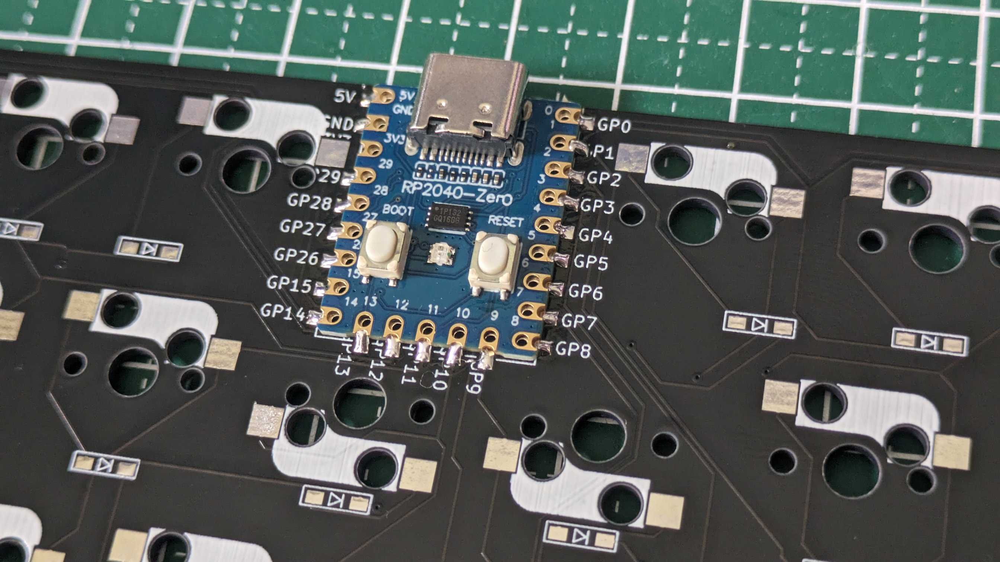

これは40%キーボードのbullykeyboardの真ん中縦に  
3u空きを作ったら打ちやすいと思って作ったキーボードです  

在庫がある場合に限り  
興味がある方にお配りしておりますがもし作る機会のある方がおられましたら  
https://t.co/pTUgpPy3nN  
に欲しいものリストがあるので、気に入った方はご褒美お待ちしております。  
  
#build guide  
完成させるにあたり、用意するもの  
*RP2040-ZERO  
*ケース（bullyを流用する際は加工が必要）  
*tadpole pin  
*SMDダイオード…45個  
*cherry MX スイッチソケット…45個  
*約6mmのネオジム磁石　10個（私はセリアで購入）  
  

基板表面
  

基板裏面（RP2040-ZERO）取付位置  
横からマイコンと基板をはんだでとりつけてください  
  
ソケットピンを指して固定しながらはんだ付けします。  
このページの下にはんだした写真がありますので文章がわかりにくい場合は必ず下の写真をご確認ください。  
  
  
マイコンの裏面（ボタンが無いほう）にも接続Pinがあるので大量にはんだを付けると  
そちらへもつながってしまい予期せぬ動作不良を招く可能性がありますのでご注意ください。
  

  
SMDダイオード（取付向きに注意！！）とMXスイッチソケットを付けた状態（基板裏面）  
  

片方に予備はんだをどうぞ  
  

  
ソケットスイッチにも予備はんだをどうぞ
  

予備はんだを温めなおした後、反対側にもはんだをどうぞ
  

ダイオードとソケットスイッチを完全に取り付けた状態。  
（はんだつけ忘れにご注意ください）  
  
  

トッププレートをかぶせてからキースイッチを取り付けてください  
Tadpole pinの取り付け（8個）  
  

別アングル
  

ケースを取り付けて完成。
