これは40%キーボードのbullykeyboardの真ん中縦に  
3u空きを作ったら打ちやすいと思って作ったキーボードです  

  
#build guide  
完成させるにあたり、用意するものは以下の通り  
*RP2040-ZERO  
*ケース（bullyを流用する際は加工が必要）  
*tadpole pin…8個  
*SMDダイオード…45個  
*MX スイッチソケット…45個  ![MXスイッチソケット]https://talpkeyboard.net/items/5e02c5405b120c792616bcf9
*約6mmのネオジム磁石　10個（私はセリアで購入）  
  

基板表面
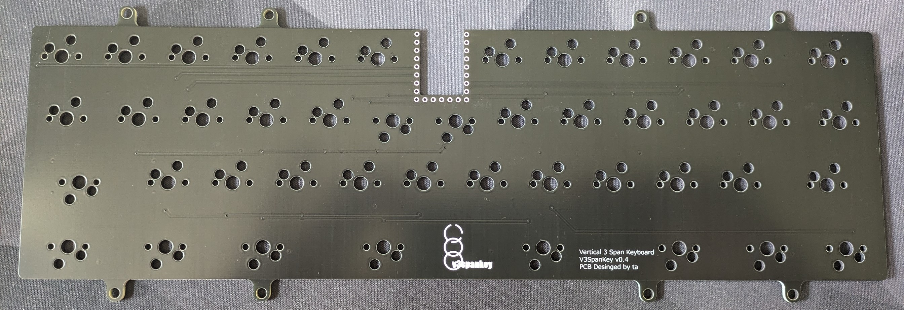  

基板裏面（RP2040-ZERO）取付位置  
横からマイコンと基板をはんだでとりつけてください  
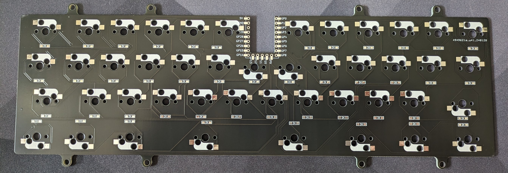  
ソケットピンをさしてマイコンを固定しながらはんだ付けします。 

このページの下のほうにはんだ付けした写真がありますのでこの文章がわかりにくい場合は、必ず下のほうの完成に近い写真をご確認ください。  
  
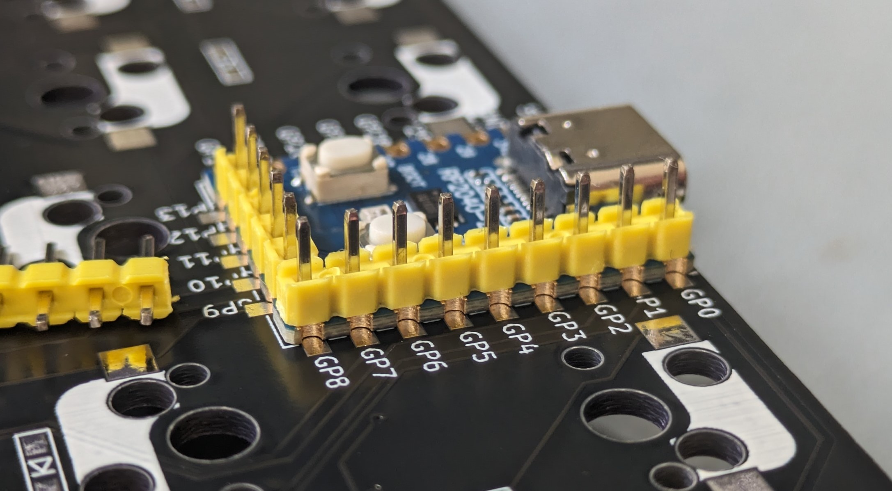  
マイコンの裏面（ボタンが無いほう）にも接続Pinがあるので（下の写真赤枠）大量にはんだを付けると  
そちらへもつながってしまい予期せぬ動作不良を招く可能性がありますのでご注意ください。
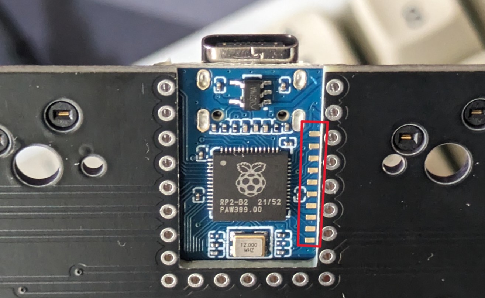  

  
SMDダイオードを取り付けてください　*取付向きに注意！！（基板裏面）  
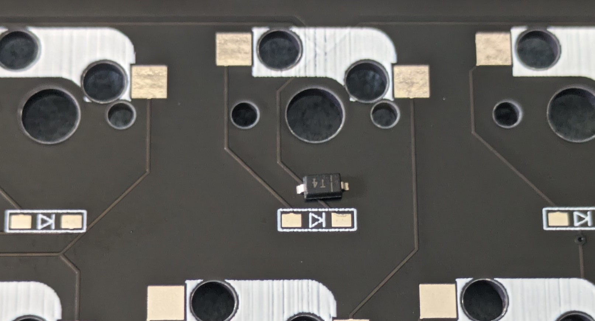  

片方に予備はんだをどうぞ  
  

  
ソケットスイッチにも予備はんだをどうぞ
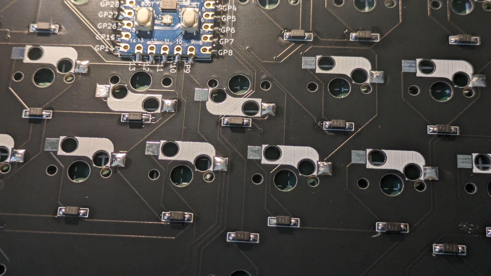  

予備はんだを温めなおした後、反対側にもはんだをどうぞ

ダイオードとソケットスイッチを完全に取り付けた状態。  
（はんだつけ忘れにご注意ください）  
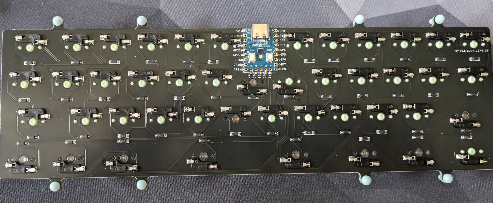  

  
マイコンにはんだがきちんとついていないとキーが反応しない場合があります。  
その際ははんだを温め直すなどしてご対応ください。  
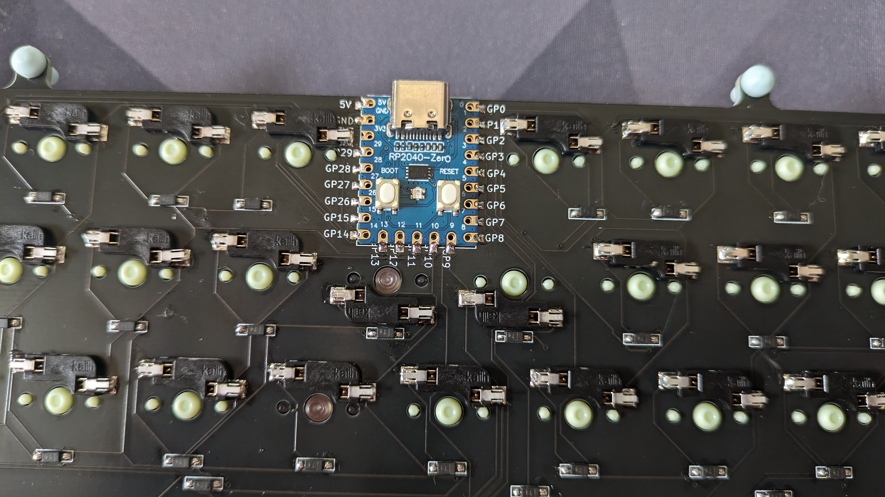  

トッププレートをかぶせてからキースイッチを取り付けてください  
Tadpole pinの取り付け（8個）  
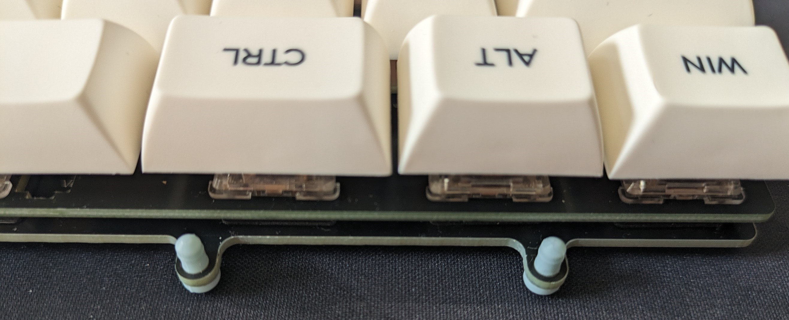  

別アングル
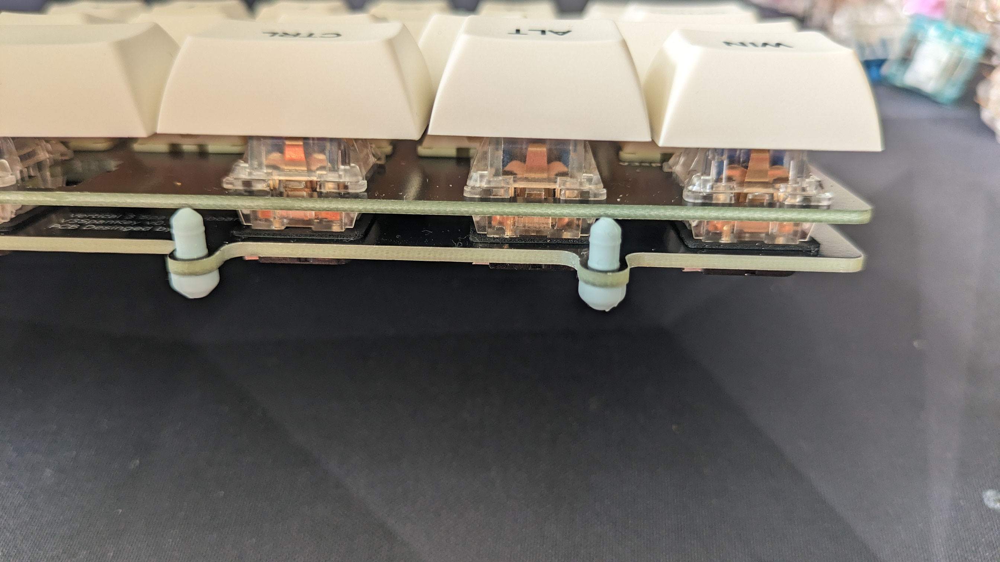  

ケース（磁石の極性に注意しながらケースにABS用接着剤で取付を行ってください。）に取り付けて完成。
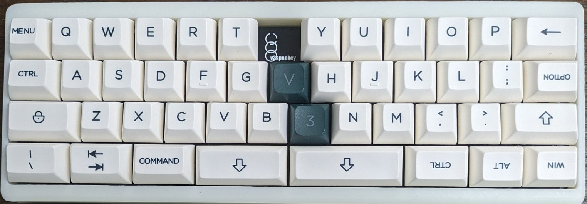  
  

この基板は在庫がある場合に限り  
興味がある方にお配りしておりますが、もし作る機会のある方がおられましたら  
https://t.co/pTUgpPy3nN  
に欲しいものリストがあるので、このキーボードが気に入った方はご褒美、お待ちしております。  
