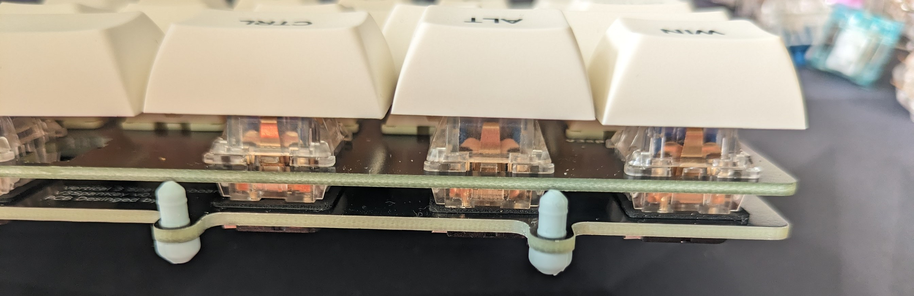

これは40%キーボードのbullykeyboardの真ん中縦に  
3u空きを作ったら打ちやすいと思って作ったキーボードです  

頒布は予定していません。  
https://twitter.com/kaeru_ta_
に欲しいものリストがあるので、もし作る機会があって気に入った方はお待ちしております。

#build guide  
完成させるにあたり、用意するもの  
*RP2040-ZERO  
*ケース（bullyを流用する際は加工が必要）  
*tadpole pin  
*SMDダイオード…45個  
*cherry MX スイッチソケット…45個  
*約6mmのネオジム磁石　10個（私はセリアで購入）  
  

基板表面
  

基板裏面（RP2040-ZERO）取付位置  
横からマイコンと基板をはんだでとりつけてください  
  

SMDダイオード（取付向きに注意！！）とMXスイッチソケットを付けた状態（基板裏面）  
  

トッププレートをかぶせてからキースイッチを取り付けてください  
Tadpole pinの取り付け（8個）  
  

別アングル
  

ケースを取り付けて完成。
