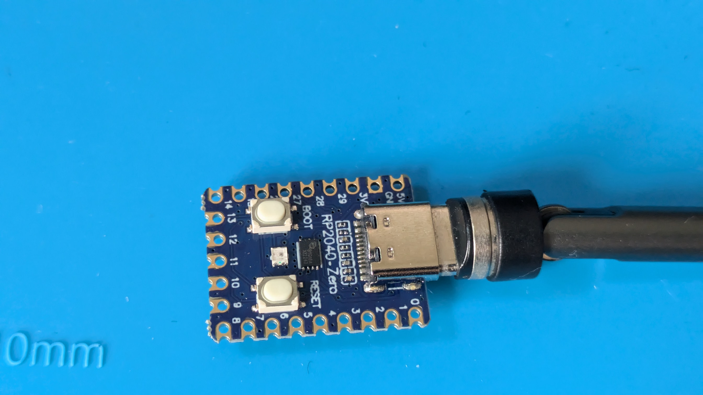
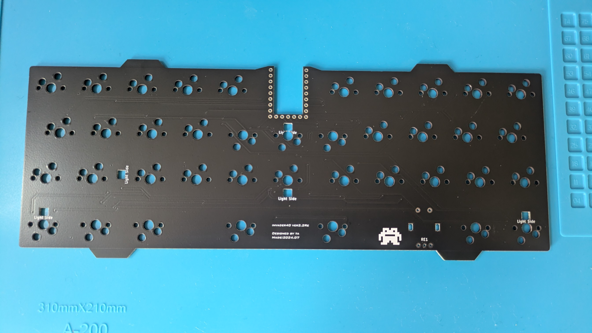
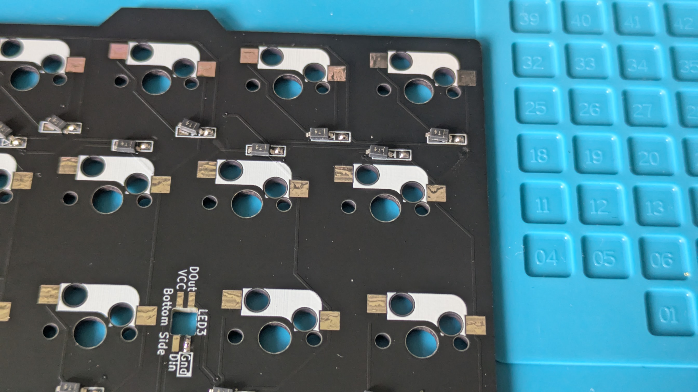
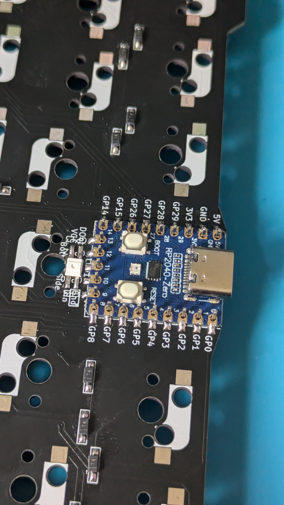
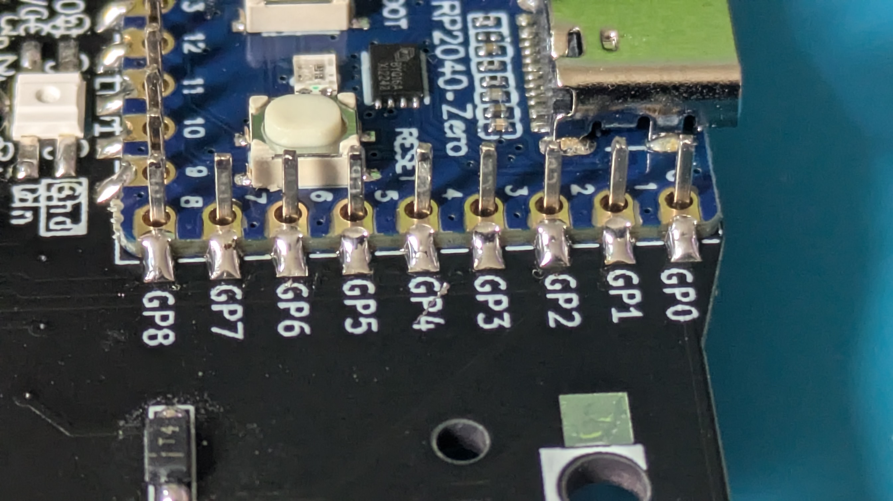

これは40%キーボードTS配列を参考にして
真ん中に空きを作ったキーボードです  

在庫がある場合に限り  
興味がある方にお配りしておりますがもし作る機会のある方がおられましたら  
https://t.co/pTUgpPy3nN  
に欲しいものリストがあるので、気に入った方はご褒美お待ちしております。  
  
#build guide  
完成させるにあたり、用意するもの  
*RP2040-ZERO  
*ケース（別途配布）  
*SMDダイオード…40個  
*LED（SK6812 MINI-E）
*cherry MX スイッチソケット…41個  
*約6mmのネオジム磁石　10個（私はセリアで購入）  
  

はんだ付けする前にRP2040-ZEROにファームウェアが焼けるか確認

基板表面
  

SMDダイオードを取り付けてください。予備はんだをしておくと便利です　*取付向きに注意！！（基板裏面）  
  

基板裏面（RP2040-ZERO）取付位置  (表裏の向きに注意）
横からマイコンと基板をはんだでとりつけてください  
  
ソケットピンをさしてマイコンを固定しながらはんだ付けします。 

  
マイコンの裏面（ボタンが無いほう）にも接続Pinがあるので（下の写真赤枠）大量にはんだを付けると  
そちらへもつながってしまい予期せぬ動作不良を招く可能性がありますのでご注意ください。
  

  

  
ソケットスイッチにも予備はんだをどうぞ
  

ダイオードとソケットスイッチを完全に取り付けた状態。  
はんだつけ忘れにご注意ください  
  
  

トッププレートをかぶせてからキースイッチを取り付けてください  

ネオジム磁石をケースにABS接着剤で取り付けてください。

ケースに基板を取り付けて完成。
